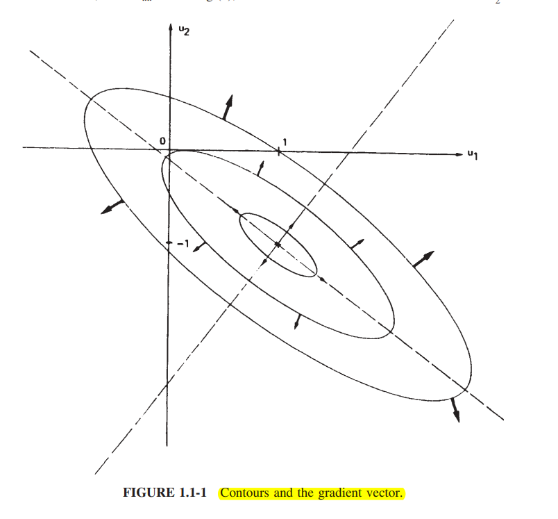
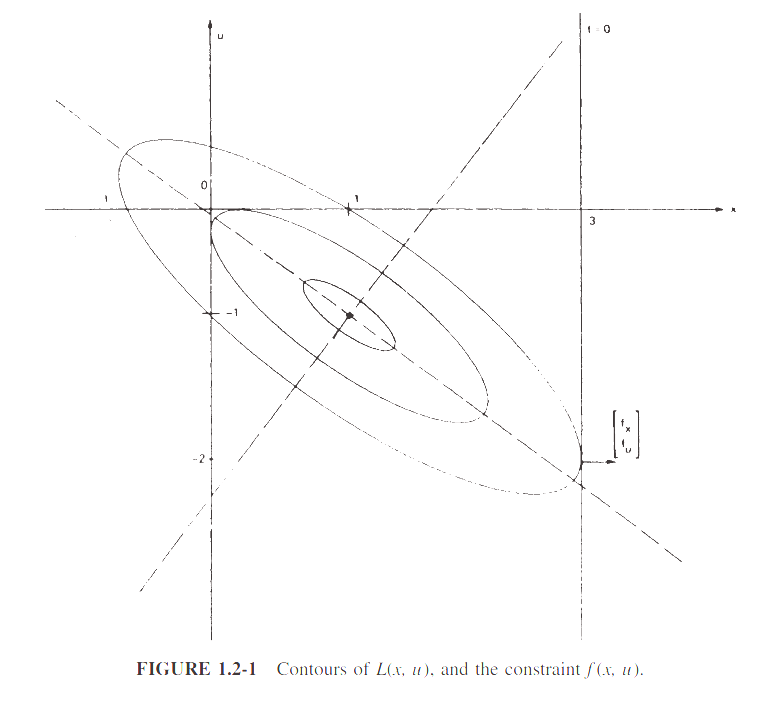

# System Theory Markdown HW1

---

# Chapter 1 - Static Optimization

Chapter 1 introduces **static optimization**, where time is not considered as a parameter.

The main idea is to determine a control or decision variable that minimizes a given performance index.

---

## 1.1 Optimization without Constraints

A **scalar performance index**

$$
L(u)
$$

is given as a function of a **control or decision vector**

$$
u \in \mathbb{R}^m.
$$

The objective is to find the value of $u$ that minimizes $L(u)$.

### Taylor Series Expansion

The increment in $L$ can be expressed using a Taylor series:

$$
dL=L_u^Tdu+
\frac{1}{2}du^TL_{uu}du+
O(3),
$$

where $O(3)$ represents third-order and higher-order terms.

The **gradient** of $L$ is

$$
L_u
\triangleq
\frac{\partial L}{\partial u}.
$$

The **Hessian matrix**, also called the **curvature matrix**, is

$$
L_{uu}
\triangleq
\frac{\partial^2L}{\partial u^2}.
$$

In this textbook, the gradient is defined as a **column vector**.

---

### Critical Point

At a critical or stationary point, the first-order change in $L$ must be zero for any small change $du$.

Therefore,

$$
L_u=0.
$$

After finding a critical point, the Hessian is used to determine its type.

- If

$$
L_{uu}>0,
$$

the critical point is a **local minimum**.

- If

$$
L_{uu}<0,
$$

the critical point is a **local maximum**.

- If $L_{uu}$ is **indefinite**, the critical point is a **saddle point**.

- If $L_{uu}$ is **semidefinite**, higher-order terms must be examined.

---

### Example 1.1-1 - Quadratic Surfaces

Consider the quadratic performance index

$$
L(u)=
\frac{1}{2}u^TQu+S^Tu.
$$

The gradient is

$$
L_u=Qu+S.
$$

At the critical point,

$$
Qu+S=0,
$$

so the optimal control is

$$
u^*=-Q^{-1}S.
$$

The Hessian is

$$
L_{uu}=Q.
$$

Therefore, the properties of $Q$ determine the type of critical point.

For example,

$$
Q=\begin{bmatrix}
1&1\\
1&2
\end{bmatrix},
\qquad
S=
\begin{bmatrix}
0\\
1
\end{bmatrix}.
$$

Then

$$
u^*=-Q^{-1}S=
\begin{bmatrix}1\\-1
\end{bmatrix}.
$$

Since

$$
Q>0,
$$

the critical point is a **minimum**.

The corresponding minimum value is

$$
L^*=-\frac{1}{2}.
$$

> The gradient is perpendicular to the contour lines and points in the direction in which $L(u)$ increases.

---

### Example 1.1-2 - Optimization by Scalar Manipulations

The same optimization problem can also be solved using scalar variables.

Consider

$$
L(u_1,u_2)=
\frac{1}{2}u_1^2+
u_1u_2
+
u_2^2
+u_2.
$$

At a critical point,

$$
\frac{\partial L}{\partial u_1}=u_1+u_2=
0,
$$

and

$$
\frac{\partial L}{\partial u_2}=u_1+2u_2+1=
0.
$$

Solving the two equations gives

$$
u_1=1,\qquadu_2=-1.
$$

Therefore,

$$
u^*=\begin{bmatrix}
1\\-1\end{bmatrix},
$$

which is the same result obtained using the vector formulation.

The vector form is useful because it simplifies calculations for higher-dimensional systems.

---

## 1.2 Optimization with Equality Constraints

Now consider a scalar performance index

$$
L(x,u),
$$

where

$$
x\in\mathbb{R}^n
$$

is an auxiliary or **state vector**, and

$$
u\in\mathbb{R}^m
$$

is the **control vector**.

The goal is to minimize $L(x,u)$ while satisfying the equality constraint

$$
f(x,u)=0.
$$

Because of this constraint, $x$ and $u$ cannot be varied independently.

---

### Lagrange Multiplier

Introduce the **Lagrange multiplier**

$$
\lambda\in\mathbb{R}^n.
$$

Then define the **Hamiltonian**

$$
H(x,u,\lambda)=
L(x,u)+\lambda^Tf(x,u).
$$

The equality constraint is now included inside the Hamiltonian.

---

### Necessary Conditions

For a stationary point, the following conditions must hold:

$$
H_\lambda=\frac{\partial H}{\partial\lambda}=f(x,u)=
0,
$$

$$
H_x=
\frac{\partial H}{\partial x}=
L_x+f_x^T\lambda=
0,
$$

and

$$
H_u=
\frac{\partial H}{\partial u}=
L_u+f_u^T\lambda=
0.
$$

These equations are normally used to determine

$$
x,\qquad \lambda,\qquad u.
$$

Although $\lambda$ is usually not the final quantity we are interested in, it acts as an intermediate variable that helps us determine the optimal $x$ and $u$.

---

### Why Introduce the Lagrange Multiplier?

Without the Lagrange multiplier, the variations $dx$ and $du$ are related through the constraint

$$
f(x,u)=0.
$$

Introducing $\lambda$ gives an additional degree of freedom.

As a result, the constrained optimization problem

$$
\min L(x,u)
\qquad
\text{subject to }
f(x,u)=0
$$

can be studied using the stationary conditions of the Hamiltonian.

---

### Sufficient Condition

The necessary conditions only identify a **stationary point**.

To guarantee that this point is a constrained minimum, the constrained curvature matrix must be positive definite:

$$
L_{uu}^{f}>0.
$$

The constrained curvature matrix is

$$
L_{uu}^{f}=
H_{uu}-
f_u^Tf_x^{-T}H_{xu}-
H_{ux}f_x^{-1}f_u
+
f_u^Tf_x^{-T}H_{xx}f_x^{-1}f_u.
$$

If

$$
L_{uu}^{f}>0,
$$

the stationary point is a **constrained minimum**.

If it is negative definite, the stationary point is a constrained maximum.

If it is indefinite, the stationary point is a saddle point.

---

### Example 1.2-1 - Quadratic Surface with Linear Constraint

Consider

$$
L(x,u)=
\frac{1}{2}x^2+xu+u^2+u
$$

with the equality constraint

$$
f(x,u)=x-3=0.
$$

Define the Hamiltonian

$$
H=
L+\lambda f.
$$

Therefore,

$$
H=
\frac{1}{2}x^2
+
xu
+
u^2
+
u
+
\lambda(x-3).
$$

The necessary conditions are

$$
H_\lambda=
x-3=0,
$$

$$
H_x=
x+u+\lambda=
0,
$$

and

$$
H_u=x+2u+1=
0.
$$

From

$$
x-3=0,
$$

we obtain

$$
x=3.
$$

Substituting into

$$
x+2u+1=0
$$

gives

$$
3+2u+1=0,
$$

so

$$
u=-2.
$$

Finally,

$$
x+u+\lambda=0
$$

gives

$$
3-2+\lambda=0,
$$

therefore

$$
\lambda=-1.
$$

The stationary point is

$$
(x,u)^*=
(3,-2).
$$

The constrained curvature is

$$
L_{uu}^{f}=2>0.
$$

Therefore,

$$
(x,u)^*=(3,-2)
$$

is a **constrained minimum**.

The minimum value of the performance index is

$$
L^*=0.5.
$$

At the constrained minimum, the gradients of $L$ and $f$ are parallel.

Therefore, the constraint line is tangent to a contour of $L$ at the optimal point.

---

### Example 1.2-2 - Quadratic Performance Index with Linear Constraint

Consider the quadratic performance index

$$
L(x,u)=
\frac{1}{2}x^TQx
+
\frac{1}{2}u^TRu
$$

with the linear constraint

$$
f(x,u)=x+Bu+=0.
$$

Assume

$$
Q>0,\qquadR>0.
$$

The Hamiltonian is

$$
H=\frac{1}{2}x^TQx+\frac{1}{2}u^TRu+\lambda^T(x+Bu+c).
$$

The necessary conditions are

$$
H_\lambda=x+Bu+c=0,
$$

$$
H_x=Qx+\lambda=0,
$$

and

$$
H_u=Ru+B^T\lambda=
0.
$$

From the stationarity condition,

$$
u=-R^{-1}B^T\lambda.
$$

Also,

$$
\lambda=-Qx.
$$

Combining the equations gives the optimal control

$$
u^*=
-(R+B^TQB)^{-1}B^TQc.
$$

The constrained curvature matrix becomes

$$
L_{uu}^{f}=
R+B^TQB.
$$

Since $Q>0$ and $R>0$,

$$
L_{uu}^{f}>0,
$$

so the solution corresponds to a constrained minimum.

This **linear quadratic (LQ)** optimization problem is important because it will later be extended to time-varying control systems.

---

### Effect of Changes in Constraints

The Lagrange multiplier also gives information about how the optimal value changes when the constraint changes.

At an optimal point,

$$
\frac{\partial L^*}{\partial f}=
-\lambda.
$$

Therefore, $\lambda$ can be interpreted as a measure of the sensitivity of the optimal performance index to the constraint.

A large magnitude of $\lambda$ means that a small change in the constraint can produce a relatively large change in the optimal value.

---

## 1.3 Numerical Solution Methods

For simple functions $L(x,u)$ and $f(x,u)$, the stationary point may be found analytically.

However, for most practical problems, an analytical solution is difficult or impossible.

Therefore, numerical optimization methods are required.

One of the simplest methods is the **steepest descent method**.

---

### Steepest Descent Method

For constrained minimization, the basic procedure is:

1. Select an initial value of the control $u$.

2. Determine $x$ from

$$
f(x,u)=0.
$$

3. Determine the Lagrange multiplier

$$
\lambda=-f_x^{-T}L_x.
$$

4. Calculate the gradient

$$
H_u=
L_u+f_u^T\lambda.
$$

5. Update the control in the negative-gradient direction:

$$
\Delta u=
-\alpha H_u,
$$

where

$$
\alpha>0
$$

is the step size.

6. Estimate the change in the performance index.

If the change is sufficiently small, stop. Otherwise, repeat the procedure.

---

### Step Size

The choice of step size $\alpha$ is important.

If $\alpha$ is too large, the optimization may overshoot the stationary point and fail to converge.

Therefore, the step size is usually reduced as the solution approaches the optimum.

---

# Summary

The main ideas of Chapter 1 are:

- A performance index $L$ is used to measure how good a solution is.
- A stationary point satisfies

$$
L_u=0.
$$

- The Hessian determines the local curvature and helps classify the stationary point.
- Equality constraints are handled using Lagrange multipliers.
- The Hamiltonian is defined as

$$
H=L+\lambda^Tf.
$$

- A constrained stationary point satisfies

$$
H_\lambda=0,
\qquad
H_x=0,
\qquad
H_u=0.
$$

- The constrained curvature matrix can be used to determine whether the stationary point is a minimum.
- The Lagrange multiplier also represents the sensitivity of the optimal value to changes in the constraint.
- For complicated optimization problems, numerical methods such as steepest descent are required.
